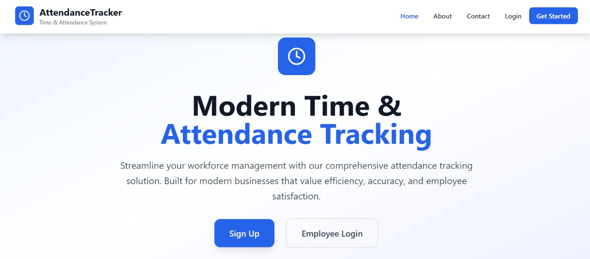
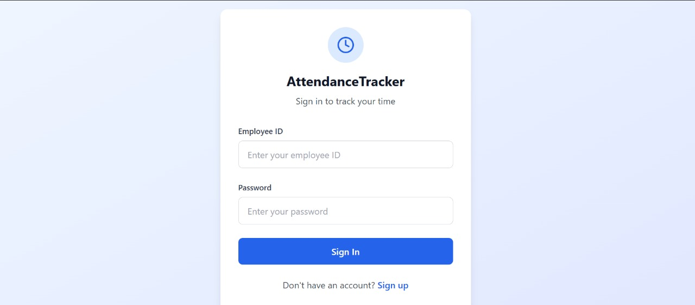
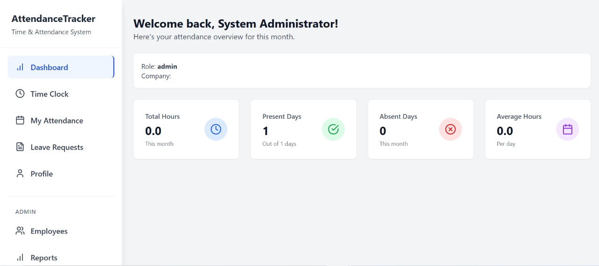
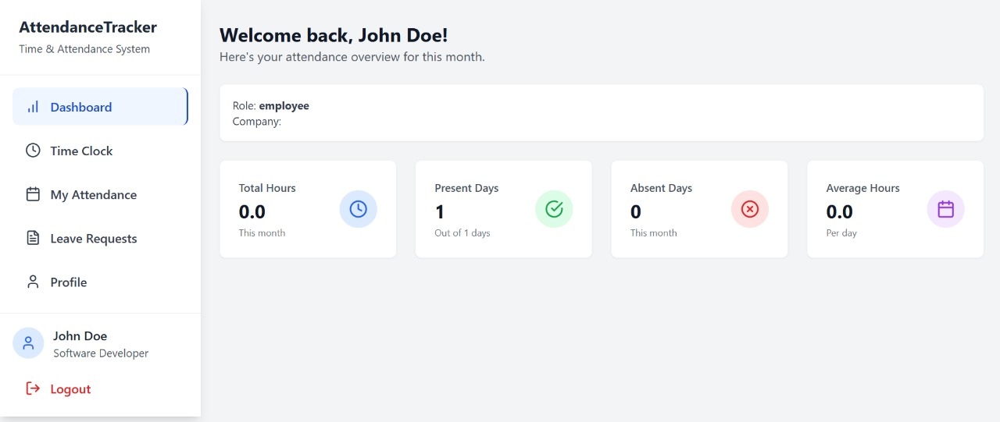
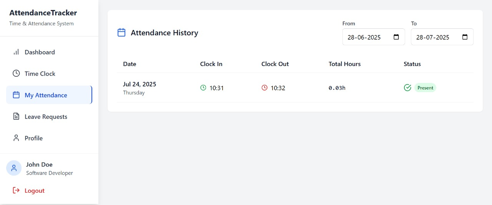
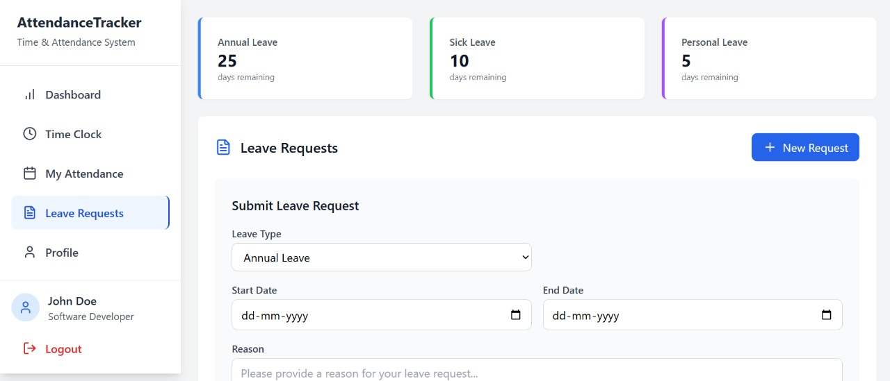

# Time and Attendance Tracking System

A comprehensive time and attendance management system built with React, Node.js, and SQLite.

## About the Project

This project is designed to help organizations efficiently track employee attendance, manage leave requests, and generate insightful reports. It provides a modern, user-friendly interface for both administrators and employees, supporting real-time tracking and robust authentication. The system is suitable for small to medium-sized businesses looking for an easy-to-deploy, full-stack attendance solution.

Key goals of the project include:
- *Accurate Time Tracking:* Ensure reliable clock-in/out records for all employees.
- *Leave Management:* Streamline the process of requesting, approving, and tracking various leave types.
- *Data Security:* Protect sensitive employee data with secure authentication and role-based access.
- *Actionable Insights:* Provide dashboards and reports to help management make informed decisions.
- *Ease of Use:* Deliver a responsive, intuitive UI for both desktop and mobile users.
- *Extensibility:* Built with modern technologies for easy customization and future enhancements.

## Table of Contents

- [Features](#features)
- [Screenshots](#screenshots)
- [Project Structure](#project-structure)
- [Prerequisites](#prerequisites)
- [Local Setup Instructions](#local-setup-instructions)
- [Demo Accounts](#demo-accounts)
- [API Documentation](#api-documentation)
- [Troubleshooting](#troubleshooting)
- [Development Tips](#development-tips)
- [Production Deployment](#production-deployment)
- [Contributing](#contributing)
- [License](#license)
- [Support](#support)

## Features

- *Employee Management*: Clock in/out functionality with real-time tracking, employee profiles, and attendance history.
- *Leave Management*: Request and manage different types of leave (sick, vacation, etc.), leave approval workflow, leave balance tracking.
- *Dashboard*: Comprehensive overview of attendance statistics, recent activity, and quick actions for admins and employees.
- *Reports*: Generate detailed attendance and leave reports.
- *User Authentication*: Secure login system with role-based access (Admin, Employee), password hashing, and JWT-based sessions.
- *Responsive Design*: Works seamlessly on desktop and mobile devices, with adaptive layouts and touch support.
- *Notifications*: Email or in-app notifications for leave approvals, clock-in/out reminders, and important updates.
- *Profile Management*: Employees can update their personal information and view their attendance and leave records.
- *Audit Logs*: Track changes and actions performed by users for accountability.
- *API-First Architecture*: RESTful API endpoints for integration with other systems or future mobile apps.
- *Easy Setup*: Simple local setup with SQLite, with options to migrate to other databases for production.

## Screenshots

### Landing Page

### Login Page

### Dashboard

### Attendance Page

### Leave Management

## Project Structure

time-attendance-tracking-system/
├── server/
│   ├── routes/
│   │   ├── auth.js
│   │   ├── attendance.js
│   │   ├── employees.js
│   │   ├── leaves.js
│   │   └── reports.js
│   ├── database.js
│   └── server.js
├── src/
│   ├── components/
│   │   ├── Auth/
│   │   ├── Layout/
│   │   ├── Dashboard/
│   │   ├── TimeClock/
│   │   ├── Attendance/
│   │   ├── Leaves/
│   │   ├── Profile/
│   │   └── Public/
│   ├── contexts/
│   ├── pages/
│   ├── App.tsx
│   ├── main.tsx
│   └── index.css
├── package.json
├── vite.config.ts
├── tailwind.config.js
└── index.html

## Prerequisites

Before you begin, ensure you have the following installed on your system:

- *Node.js* (version 16 or higher) - [Download here](https://nodejs.org/)
- *npm* (comes with Node.js)
- *VS Code* - [Download here](https://code.visualstudio.com/)
- *Git* (optional, for version control) - [Download here](https://git-scm.com/)

## Local Setup Instructions

### Step 1: Create Project Directory

1. Open VS Code
2. Open Terminal in VS Code (Ctrl+` or View > Terminal)
3. Create a new directory for your project:
bash
mkdir attendance-tracker
cd attendance-tracker

### Step 2: Initialize the Project

1. Initialize a new Node.js project:
bash
npm init -y

2. Create the project structure:
bash
mkdir server
mkdir server/routes
mkdir src
mkdir src/components
mkdir src/components/Auth
mkdir src/components/Layout
mkdir src/components/Dashboard
mkdir src/components/TimeClock
mkdir src/components/Attendance
mkdir src/components/Leaves
mkdir src/components/Profile
mkdir src/components/Public
mkdir src/contexts
mkdir src/pages

### Step 3: Install Dependencies

Install all required dependencies:

bash
# Main dependencies
npm install react@^18.3.1 react-dom@^18.3.1 react-router-dom@^7.7.0
npm install express@^5.1.0 cors@^2.8.5 bcryptjs@^3.0.2 jsonwebtoken@^9.0.2
npm install better-sqlite3@^12.2.0 date-fns@^4.1.0 lucide-react@^0.344.0
npm install recharts@^3.1.0 multer@^2.0.2

# Development dependencies
npm install --save-dev @vitejs/plugin-react@^4.3.1 vite@^5.4.2
npm install --save-dev typescript@^5.5.3 @types/react@^18.3.5 @types/react-dom@^18.3.0
npm install --save-dev tailwindcss@^3.4.1 postcss@^8.4.35 autoprefixer@^10.4.18
npm install --save-dev eslint@^9.9.1 @eslint/js@^9.9.1 typescript-eslint@^8.3.0
npm install --save-dev eslint-plugin-react-hooks@^5.1.0-rc.0 eslint-plugin-react-refresh@^0.4.11
npm install --save-dev globals@^15.9.0

### Step 4: Copy Project Files

Copy all the project files from the artifact to your local directory. You'll need to create these files:

*Configuration Files:*
- package.json (update with the dependencies above)
- vite.config.ts
- tsconfig.json
- tsconfig.app.json
- tsconfig.node.json
- tailwind.config.js
- postcss.config.js
- eslint.config.js
- index.html

*Source Files:*
- All files in src/ directory
- All files in server/ directory

### Step 5: Update package.json Scripts

Make sure your package.json has these scripts:

json
{
  "name": "attendance-tracker",
  "private": true,
  "version": "1.0.0",
  "type": "module",
  "scripts": {
    "dev": "vite",
    "build": "vite build",
    "lint": "eslint .",
    "preview": "vite preview",
    "server": "node server/server.js",
    "dev:server": "node --watch server/server.js"
  }
}

### Step 6: Initialize Tailwind CSS

1. Initialize Tailwind CSS:
bash
npx tailwindcss init -p

2. Make sure your src/index.css contains:
css
@tailwind base;
@tailwind components;
@tailwind utilities;

### Step 7: Running the Application

You need to run both the frontend and backend servers:

#### Terminal 1 - Backend Server:
bash
npm run server

This will start the Node.js server on http://localhost:3001

#### Terminal 2 - Frontend Development Server:
bash
npm run dev

This will start the Vite development server on http://localhost:5173

### Step 8: Access the Application

1. Open your browser and go to http://localhost:5173
2. You should see the homepage of the attendance tracking system

### Demo Accounts

Use these accounts to test the system:

*Admin Account:*
- Employee ID: ADMIN001
- Password: admin123

*Employee Account:*
- Employee ID: EMP001
- Password: password123

## VS Code Extensions (Recommended)

Install these VS Code extensions for better development experience:

1. *ES7+ React/Redux/React-Native snippets*
2. *Tailwind CSS IntelliSense*
3. *TypeScript Importer*
4. *Auto Rename Tag*
5. *Bracket Pair Colorizer*
6. *GitLens*
7. *Prettier - Code formatter*
8. *ESLint*

## Troubleshooting

### Common Issues:

1. *Port already in use*: Change the port in server/server.js or kill the process using the port
2. *SQLite errors*: Make sure you have write permissions in the project directory
3. *Module not found*: Run npm install to ensure all dependencies are installed
4. *CORS errors*: Make sure both servers are running on the correct ports

### Database Location

The SQLite database (attendance.db) will be created automatically in your project root when you first run the server.

## Development Tips

1. *Hot Reload*: Both frontend and backend support hot reload during development
2. *Database Reset*: Delete attendance.db file to reset the database
3. *Logs*: Check the terminal for server logs and browser console for frontend logs
4. *API Testing*: Use tools like Postman to test API endpoints at http://localhost:3001/api/

## Production Deployment

For production deployment:

1. Build the frontend: npm run build
2. Serve the built files with a web server
3. Configure environment variables for production
4. Use a production database (PostgreSQL, MySQL, etc.)
5. Set up proper authentication and security measures

## Support

If you encounter any issues:

1. Check the terminal for error messages
2. Ensure all dependencies are installed
3. Verify that both servers are running
4. Check the browser console for frontend errors
5. Make sure ports 3001 and 5173 are available